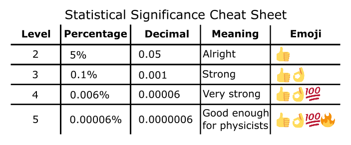
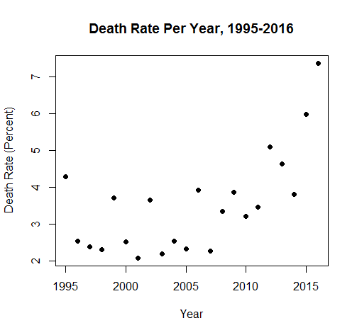
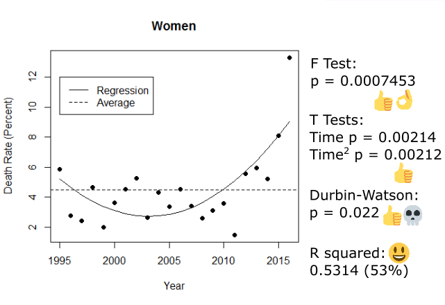
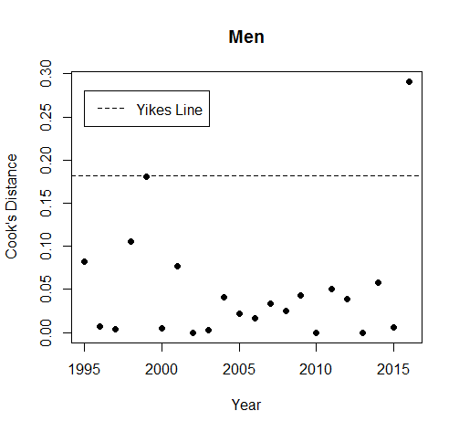
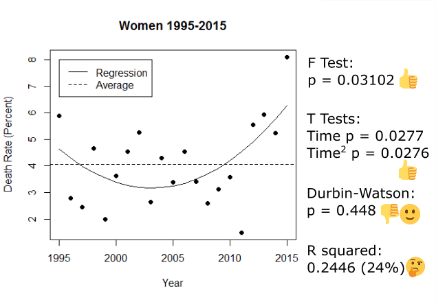

#Quantify your gays: the statistics of queer death in TV
Sage Anastasi, August 2018

## Introduction

###About the author & contact information
I'm a third year student at Otago University, New Zealand, double majoring in statistics and communication studies. I can be contacted via <a href="https://twitter.com/SageAnastasi">twitter</a> and <a href="https://sageanastasi.wordpress.com/">my blog</a>  (email upon request). The data for this project can be downloaded <a href="https://drive.google.com/open?id=1ewUbHqSat-gadZez6Ul-aH6Jqfsog1RZ">here</a>, and the analytical script can be downloaded <a href="https://drive.google.com/open?id=1Nv-2D2Es22oPH06hcoC4ejmDnSjMh_Hn">here</a>. The draft academic paper can be found <a href="https://drive.google.com/file/d/0Bw2Bm-oy7c7heDMtbVl6Q1dYd1E/view?usp=sharing">here</a> if you're a geek and really want to read the 7,000 word version.

###The media kerfuffle that started it all
The issue of gay death in tv became particularly relevant in the media landscape in March of 2016 when tv drama 'The 100' killed off its most prominent lesbian character right after she got into a relationship. This was quickly pegged as an example of <a href="http://variety.com/2016/tv/opinion/the-100-lexa-jason-rothenberg-1201729110/">the 'bury your gays' trope</a> in which gay characters are killed off immediately after they enter relationships or immediately after they come out. 

<a href="https://www.themarysue.com/the-lexa-pledge/">TV fans didn't take this all lying down, though</a>. Groups of queer fans orchestrated huge social media campaigns against shows that killed off queer characters, some ran a fundraiser for American queer helpline The Trevor Project that raised over $160,000USD, and the charity "LGBT Fans Deserve Better" was formed with the express purpose of promoting better queer representation.

A few brave journalists decided to tackle the problem from a statistical angle. *Vox* journalist Caroline Framke figured out that <a href="http://www.vox.com/a/tv-deaths-lgbt-diversity">10% of the deaths in the 2015-16 TV season were queer women</a>, which seems pretty high. Marie Bernard and Heather Hogan of Autostraddle worked together to make <a href="http://www.autostraddle.com/autostraddles-ultimate-infographic-guide-to-dead-lesbian-tv-characters-332920/">a cool infographic</a> of the overall state of queer representation in TV. In the academic sphere, Meredith Bartley and Kira Deshler each took a shot at calculating the percentage of queer female characters who died (~40%). <a href="https://lgbtfansdb.com/editorial/2016-2017-year-in-review/">LGBT Fans Deserve Better also released some statistics</a>, though this happened after I started my project and therefore didn't influence the development.

Sadly, every analysis has its flaws. The 40% death statistic quoted by both Bartley and Deshler is unrealistically high; it comes from looking at *all deaths in the world* as a proportion of *american characters*, rather than in comparison to all the characters in the world - I calculate the correct version of this statistic later on. We also currently have no articles discussing long-term trends in queer death, such as whether more characters are dying in recent years than in the past, which makes it difficult to know whether 2016's high death rate is a fluke or part of something broader. The biggest problem, though, is that all the statistics we have right now could just be due to random chance. We know that 10% of dead characters in 2015 were queer women; we don't know if that's unusual enough to point to a broader issue with TV. There are types of statistics - called hypothesis tests, and explained down in the Analysis section - that can tell us whether the percentages we find are caused by chance or not, but nobody's used these tests to check their results yet :( 

##Aims
This project has two goals:
-	Establish a comprehensive database of all queer characters in TV, and make it freely accessible for other people to use.
-	Use this data to examine claims made about queer death in tv: are women being killed more often? Does the number of dead characters change over time, or is it pretty stable? Was 2016 part of a pattern or just a horrible fluke?

##Data collection
Building a spreadsheet of every queer character ever turned out to be really hard. Since this isn't an issue that anyone has been tracking yet (aside from GLAAD, who refused to give me their data), the first step was finding a data source. For this, I turned to the next best thing: Wikipedia. 

Now, Wikipedia doesn't have one list of queer characters. Instead it has six. These are mostly split up by genre (gay characters in sitcoms, gay characters in dramatic series, etc), so before I could even start figuring out who lived and died I had to roll all those pages into one spreadsheet. In total, after I'd taken out the duplicate entries, there were more than 2,000 characters on the list

Not all characters are created equal, however. Other authors decided to cut ones who'd only appeared in a couple of episodes out of their analyses, as these characters were too minor to have any real impact on the show. I did the same, using IMDb to check whether a character had been in three or more episodes (or more than a quarter, if it was a very short show) and dropping them from the data if they hadn't.

This was the point where I enlisted two of my friends. Turns out checking over 2,000 characters against their IMDb entries is a *lot* of work. 

Tossing out the extremely minor characters brought the list down to about 1,800. Along with figuring out whether they got to stay, we logged some extra data about each character: the show they were on, what year they first appeared, what year they finally left, how many years they were there, the number of episodes they appeared in, the number of episodes the show had *in total*, which month their last episode was in, and their gender.

All that was left was to figure out who lived and who died. This meant going through the whole spreadsheet *again* and looking for the characters that appeared on Marie Bernard's lists of <a href"https://www.queerty.com/bury-your-gays-108-dead-gay-and-bisexual-male-tv-characters-and-how-they-died-20160325">dead queer men</a> and <a href="http://www.autostraddle.com/all-65-dead-lesbian-and-bisexual-characters-on-tv-and-how-they-died-312315/">women</a>. These lists may be incomplete, especially since the list of men didn't get the audience help that the list of women did, but they're the best we could find. By noting down who *had* died, the rest was quick to fill in; it's a pretty safe assumption that if someone isn't listed as dead, they could be marked as "not dead".

That's it. That's how we got the data. Now here's what I did with it.

##Analysis

Like a lot of stats projects, this analysis has several stages. We start with the descriptive statistics, such as percentages, to get a feel for the data and figure out where to go. From there, we use tests to try and work out if our weird percentages mean anything, or if they're just because of chance. Finally, to find out what's happening over time we have to make graphs and draw lines through them - a kind of analysis called linear regression.

Every analysis starts with basic numbers and percentages, since they let us get a feel for what's going on and what we might need to look for. 

In our data there are 1728 characters in total. 981 of them were men and 747 of them were women, so while men are a little more prominent, the gender split is closer to 50/50 than we might've thought. 

223 of these characters died - 93 men and 130 women. That's a little surprising; more men overall, but fewer men dying? It might be worth looking at whether gender is having an impact on who dies.

The percentage of women who died overall was 17.4%. This is a lot lower than the 40% claimed by other analysts. Other researchers found their death percentage by comparing Autostraddle's list of dead queer women (130) to <a href="https://www.autostraddle.com/autostraddles-ultimate-infographic-guide-to-dead-lesbian-tv-characters-332920/">the number of queer women on TV reported by Heather Hogan (383)</a>, you get 40%. Yet this statistic has a significant flaw in its construction. The first is that Hogan seems to only have counted american characters, but the death list includes ones from all over the world; it would be like taking all the deaths in the world as a percentage of the American population - a vast overestimate.  The reason that this study got a much lower number - 17.4% - is that it compares all the deaths in the world to all the characters in the world; unlike the other attempts, this one is based on a fair comparison.

If we restrict the data to years after 1995 ("modern" tv), when there were enough gay characters around to actually be worth talking about, then the average death rate each year is 3.5% (so 35 out of every thousand characters were dying). This figure is slightly lower for men and slightly higher for women, but it's within 1% on either side. Specifically in 2016, however, the death rate of all gay characters was 7.4%; if we look at gender, this breaks down into 2.5% for men and 13.3% for women, which seems to reflect the whole "wow, a lot of lesbian characters are dying in 2016" observation that many critics made.

Unfortunately, percentages aren't proof. All we can do with these numbers is look at them and say "oh, that looks bad"; we have no way of showing that they're not just the product of chance. As such, this is the point where we have to move beyond the safe, simple realms of basic numbers and into the scary-sounding kinds of statistics that they teach at university. I won't be using the jargon or showing the calculations here, because they're complicated and boring; instead, I'll be using a careful walkthrough of the tests to help get the underlying ideas across.
The first question is: if percentages and raw numbers aren't proof, what is? Over a long time, statisticians have developed a method for showing that results are too weird to be chance, and things shown to be "significant" through this method are considered good enough to be proof. Significance is the measurement of how *unlikely* we are to get the results that we did; it's usually expressed as a percentage, and if it's very small then you're very unlikely to have got your results if only chance was in play (i.e. there's something causing your data to look weird). 

Now, when you've been doing statistics for a long time you develop the ability to look at significance percentages and immediately go "that's strong" or "that's meaningless". I don't expect you to have those skills, though, so to help you get that impression we're going to use some extra tools - emojis.

Below is a table of the commonly accepted "levels" of significance. The lower your significance percentage is, the less likely it is that your results are because of chance; we split significance into a bunch of thresholds to make interpreting easier. Level 2 is the highest our percentage can be and still be significant (level 1 exists, but isn't significant for complicated maths reasons); higher levels mean more significance and therefore more ability to be sure that what we're seeing isn't just because of chance.

All of this is pretty theoretical, so let's work through the methods using my two favourite things: death and gender.

###Death And Gender: Can We Prove They're Related?
Our initial look tells us that women are dying more than men. However, those percentages could still be a fluke. How do we prove it?

Luckily, there's an entire group of tests - called "hypothesis tests" - that let us figure this out. They take into account the fact that sometimes things just happen, and are designed to tell us whether it's that or whether *something weird is going on*.

Though there are a lot of different types, all hypothesis tests have the same basic structure:
1)	Assume there's no relationship in the data. If it looks like something is happening, that's a coincidence. The things we're looking at don't depend on each other. The world is boring and perfect.
2)	Get data from the real world.
3)	Figure out how this data should look in the boring, perfect world. This could be a table of numbers, or a flat line, or something else; while the specific case varies depending on what exactly we're looking for, we can always find out what our perfect data would be (using maths, of course).
4)	Compare the data you found in real life to how it should look in a perfect world. If we grab our perfect data and give it a shake, what's the chance of it ending up like our actual data? This spits out a significance percentage.
5)	If this significance is too low (we get a thumbs up), this is evidence that the assumption you made earlier is wrong! The data you got is too weird to be a coincidence, and it looks like the variables you're looking at are related somehow.

We can use this structure to find out if women really do die more often than men, or if just it's a coincidence. Start by assuming that nothing is happening; women and men die at the same rate, and any shift away from that is only because of chance (step 1). We already have the data about death and gender, thanks to spending a whole summer scraping through Wikipedia (step 2):

Next, we figure out how this would look if men and women died at the same rate (step 3). This is done mathematically, and so we end up with impossible decimal points; for example one man is only mostly dead. In this table - from the perfect world - death and gender have nothing to do with each other.

Step 4 is to compare these tables and see what the chance of getting our real data would be. Those two tables are pretty different, and it looks like the numbers of dead characters have flipped right around, but we don't know yet if that difference is big enough to mean anything. We can use some calculations (not worked through here, because the specifics aren't relevant) to get the chance. This process is like putting the first table in a box, shaking it and then tipping it back out; the amounts in the table squares should have moved around a bit, and we want to know how likely it is that shaking it makes it look like the second table.

Our calculations find that the chance is 0.0001633% (step 5). That's really small. Thumbs up! OK! 100! It's a level 4 significance, which is very ahrd to get in sociological data; as such, we can safely say that death and gender are related to each other (since we just showed that them not being related to each other is very *unlikely*).

For the statistically inclined, yes, this was a very verbose chi-square test.

###Looking Back: Queer Death Over Time
How do we tackle the problem of historical context? We can't just make a table of death and year; that breaks the test we used (for complicated stats reasons). There's only one way forward - graphs.

First, we graph the raw number of deaths per year. 

This turns out to be pretty useless; it's just increasing each year. We've fallen victim to the first thing everyone would ask me when I was writing this: "But what if there are more queer characters every year??"

To avoid this issue we use the percent death rate rather than just the number of deaths. This is because the raw number of deaths can't account for more gay characters on TV turning up. If there are more characters, more should be dying as a result; 1 character dying out of 20 is the same percentage as 50 characters dying out of 1000, and even though 50 looks higher it doesn't mean there's anything actually wrong. However, if the proportion of characters dying - which we express with a percentage - is going up, then that can't be explained by the base number of characters increasing and might suggest that something bigger is going on. The percent death rate looks like this:

Which is a lot more informative. Glancing at the data "cloud", it seems like death was pretty stable, but has been increasing recently. As before, though, we can't just operate by looking at things and deciding that they're bad: we have to prove it. 

In order to make sense of this data we have to put a line through it and test the line. The line acts as a model of the data. If we can put a line through the graph that looks a lot like what's happening with the data, and the slope of that line changes over time, then we're able to say that the death rate is changing over the time (because our line says it is).

We have to use more than one iteration of the One Test in this case, because we have to look at a few different things in order to be sure that the line is significant:
-	The "F test", which assumes that the line is flat and is significant if it's not. In order for us to claim that time is related to death, the line needs to not be flat.
-	The "T test", which assumes that the effect of time on the death rate is zero (the line has an equation, and the test assumes that the "time" bit of that equation is zero). If time is related to death, then its influence will be something other than zero. Though it sounds like we've already shown this using the F test, we also have to run this one; if we get a slopey-looking line (significant F test) with nothing making it be slopey (insignificant T test) then something has gone horribly wrong.
-	The "Durbin-Watson test", which assumes that the T and F tests are telling the truth. We want this one to fail; if it's significant, we get the skull emoji, and it means that our model is broken and useless (specifically that we don't know if the significances of the T and F tests are as big as they say they are; they might not be significant at all)

Along with these tests, we also have a measurement. Measurements are more wobbly than tests; instead of giving a percentage that passes or fails, they just give us a number and it's up to us to decide if that number is good enough. In this case, the measurement is the "R squared". It tells us how much of the data "cloud" the line explains. The measurement itself ranges from 0 to 1, but we often think of it as a percentage; an R squared of 0.3 means that the line is explaining 30% of the data, while an R squared of 0.65 means that the line is explaining 65% of the data. Higher is better.

So, putting a straight line through the data and testing it. Here's what we get:

Look at those emojis! We have a slopey line and time making it be slopey! But wait - the Durbin-Watson test is also significant, and it has a skull next to it. This means that the assumption that the T and F tests were telling the truth is wrong; they might be lying :(. Since we can't tell if those big significances are real or not, we have to throw this line out.

Even though this model isn't reliable enough to use, it's still worth talking about the R squared. This came in at 0.41 (41%), and is a great example of having to make a judgement call about a measurement. Is explaining 41% of the data good enough? Many statisticians would say no - they can be quite "0.8 or death" about R squared values sometimes - but since we're working with murky sociological data, 41% actually isn't bad. 

Luckily, we're not limited to straight lines. The death rate seems like it was stable or even going down a bit before it started increasing, so let's see if putting a curved line through it works better:

It does! There are two T tests this time around because we have to check out the significance of both time and "time squared" (the part that makes the line curve). Everything is more significant, it's telling the truth this time (the Durbin-Watston is thumbs down but smiley because that's the outcome we were after), and the R squared has jumped up to 0.71 (71%). This is really, really good given the kind of data we have; the curved line is both definitely not flat and explains 71% of the changes in the data cloud. We've found a strong, useful model. 

Since the model is so good, we can use it to talk about the data. According to this analysis the death rate used to be decreasing, up until about 2003 when it flipped around to increasing again. 

###Doesn't Gender Affect Things?
We know that gender is important overall, so it's worth checking out whether it affects the year-to-year death rate. This isn't something we can get hard proof for; the structure of the data makes doing those tests impossible, so we can only get an indication as to whether it might have an impact.

To do this we split the data up by gender and run two separate regressions. If the lines are different, that suggests that gender is having an impact; if it wasn't, then splitting up the regressions by gender wouldn't change the lines and they would look the same.

These regressions look different, for sure. One of them is significant and the other isn't. For men, there's no relationship between time and the yearly death rate; the fluctuations are random. However for women there is a relationship similar to the one we found in the data overall (just weaker). Unfortunately, we have the same problem as with our straight line regression; the significances in the women-only regression are lying to us, so we can't tell if it's actually significant and different from the insignificant men. As such, we can't make any claims about the impact of gender on the yearly death rate :/

###Outlier Points (Or: 2016 Is Messing Everything Up, As Usual)
Since we know what's happening with the death rate, we can now start to work out whether 2016 was an outlier. Most people think it is, and it certainly appears to be one, but we need better evidence before we just justify kicking it out of the data.

Finding outliers requires another kind of measurement, called the Cook's Distance. This measures the amount of *undue* influence a point is having on the slope of our regression line. Some influence is alright - that's what gives the line its shape - but outlier points exert too much influence on the line and drag it out of place. Unlike the R squared, the Cook's Distance is just a number; it starts at zero and tends to be very small.

To help us decide whether a point is an outlier, we have two handy decision-making thresholds. The first is 4/22, but that's boring and difficult to remember so from here on it's called the Yikes Line. If a Cook's Distance is higher than the Yikes Line, it might be an outlier; it has enough undue influence that we should go back and check it out in the context of the data around it, and take it out if it's being a problem. The second threshold is 1, known here as the Zoinks Line, and if a point exceeds this then it's definitely an outlier. 

Let's check out the Cook's Distances, as measured against the cool and accurate curved line we found earlier:

Three points break the Yikes Line; the Zoinks Line is too high to make it on to the graph. 1995, 2014 and 2016 might be outliers. If we go back to the data and check them out,

We find that 1995 is on par with years like 1999 and 2002, it just happens to be a little bit high for where it is; not a problem. 2014 is similar to these years as well, but it got flagged as an outlier for being lower than anticipated. 2016 is very high compared to the rest of the data, though; we could justify taking it out to see if it makes the regressions better. 

Before we do, though, breaking things down by gender again is a good idea. After all, 2016 was allegedly an outlier *for women*; it might not be one for men at all, and splitting things up could provide some clarity. We take the Cook's Distances based on the curved lines for men and women (even though the womens' line failed, we're allowed to use it; the bits that were broken don't affect this measurement):

Similarly to when we drew the lines earlier, men are fine. 2016 is above the Yikes Line, but it we look at it in the data we find that it was lower than we expected; not an outlier. Women are very much not fine, however. This is the first time the Zoinks line has turned up, and 2016 breaks it. There's no doubt that, for women, 2016 is an outlier.

###Queer Death Over Time 2: Outlier Removal Boogaloo
Since 2016 is an outlier overall and a very bad one for women, we should take it out of the regressions and re-run them. 

The significances and R squared all look a bit worse, although they're still strong. The R squared has dropped to 59% from our previous 71%; despite this, 59% is still a very good amount of explanation. It's tempting to say that the model has become worse because we took out 2016, but that's not quite what's happening here. Having that outlier in the data was making time seem like it was more important than it was; by taking it out, we have a more accurate model which tells us that time wasn't as important as it seemed. This makes sense; there are lots of complicated human factors that will be affecting the death rate of queer characters in TV, and so simple change over time may not be an adequate model.

It's important to note that we don't know *why* the death rate is changing over time. We know that it is, but we can't make the leap from what is happening to why. Digging into the causes was never the aim of this project; we were only looking to nail down what's going on.

###Gender Again, For The Last Time
We've taken out a massive gender-based outlier, so we should re-run our regressions on gender to see if they work now.

They do! There's still no significant trend for men, but the regression for women passes our diagnostic test. These two lines are different, which is what we were looking for, so it it seems like different things are happening with the death rate between genders; the line for women also echoes the overall curve (same pattern), so it's possible that the death rate of women is a factor that affects the overall death rate.

##Discussion (Admitting The Mistakes)
This project isn't perfect. The most obvious issue is the integrity of the data; since it was scraped from Wikipedia and IMDb, there are going to be missing cases. In particular the calculated death rate of queer men is likely to be lower than it actually is, since the list of dead queer men I drew the data from was less rigorously checked than the list of dead queer women. This is an issue for any analysis that relies on community-curated lists; I hope that the data used here is as accurate as possible under the circumstances.

It was impossible - or at least so difficult as to not be worth it - to find data on characters' race, specific orientation (lesbian/bisexual/panseual/etc), and status as a regular or minor character. These variables had to be left out of the project, when they may help explain why characters live or die.

Logistic regression could have been a valuable addition to the analysis, since the outcome variable is a binary (died/lived). It was left out of this paper due to the importance of finding outliers and the fact that it is much more difficult to explain.

##Conclusions
We have found strong evidence that:
-	In TV as a whole, women die disproportionately more than men.
-	The yearly death rate of queer characters has been decreasing since 1995, but has been increasing again since approximately 2002.
-	2016 was a horrible fluke in death, particularly for queer women.

We also have weak evidence that the yearly death rate is affected by what happens to women, but we do not have the tools to prove this to the level that would turn it into strong evidence.

##Next steps
There are still so many things that could be done. This project established base-level knowledge of aspects such as outliers and death rate, but there are many more avenues to explore. More complex models such as ARIMA or logisitc regression could give new insights into the data.

Improving the data set would open several new lines of analysis. We still don't know whether there's a link between queer characters being secondary and their tendency to get killed, and building race and/or orientation into a study would make it much more nuanced and accurate.

Lastly, it isn't 2016 any more; a worthwhile project would be to update the data and examine what the impact of 2016's death spike is going forward.

##References & Acknowledgements
Many thanks to Dr Holly Randall-Moon, Dr Rosemary Overell, and Dr Matt Parry of the Univerity of Otago for their advice and support. Thanks also to David Hood for advice and help writing the R script. Lastly, thanks to Joss Anastasi and Catherine McNamara for helping rescue my data from the depths of IMDb purgatory.

I've put in links to the relevant artivles throught the writeup where possible, but I also cited a couple of real academic papers:

Bartley, Meredith. 2016. "Victory Stands on the Back of Sacrifice: The Bodies and Body Politics of Lesbian and Bisexual Women on TV." *Atrium*, 236-262. Accessed August 2017. http://www.american.edu/cas/literature/wsp/upload/Atrium_2016.pdf#page=236

Deshler, Kira. 2017. "Not Another Dead Lesbian: The Bury Your Gays Trope, Queer Grief, and The 100" *Honours Thesis*. http://arminda.whitman.edu/theses/333
